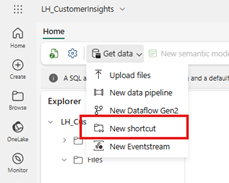
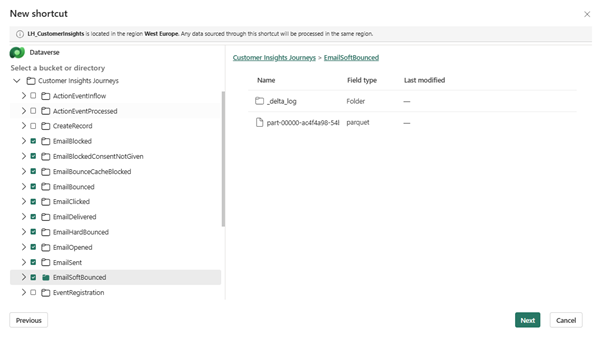
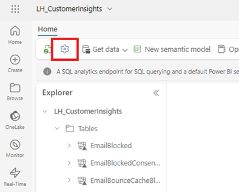
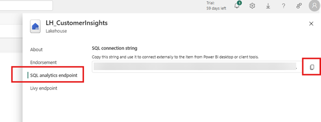
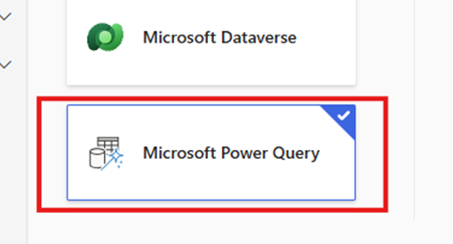
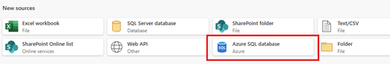
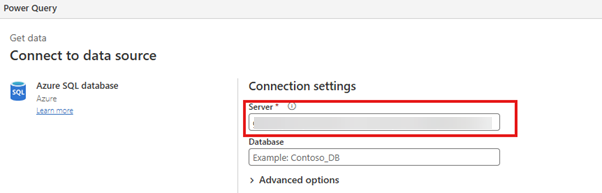
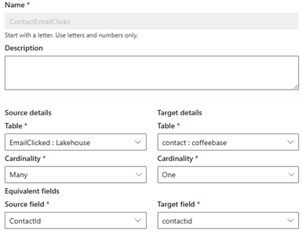

So, funny story. I’ve got a younger (but taller) sister, <a href="https://www.linkedin.com/in/lotte-oudejans-343021147/" target="_blank">Lotte</a>, who is working as a Data Lead in the Dynamics, Power Platform, and Fabric domain! Whoop whoop 🥳 We join forces in this blog because data is the ultimate source for every marketer!

### Fabric - Things We Know

We know the interaction data of emails sent through Dynamics Customer Insights - Journeys is available in Fabric.

We know we can build awesome Power BI reports with this data in combination with other Dataverse and marketing data!

But what if we want to build segments in Customer Insights - Data that contain this interaction data as well? We know this is coming in a future release wave, but what if we told you that we can actually do it right now?

Cool, huh?

### Customer Insights - Data - Things You Probably Didn’t But Want to Know

If we look at the connectors inside Customer Insights - Data, we’ve got quite a few choices. However, we are still waiting for the OneLake connector.

But…

Did you know that, in the backend, the Fabric environment is entirely composed of Azure components?

Do you know what this means?

We can use the standard Power Query connector to connect directly to the Azure SQL Database 😱🥳

Say what?!

Whoop whoop 🙌 

This means we CAN get the interaction data inside Customer Insights - Data! Just follow this cool step-by-step approach from my sister Lotte!

### Step-By-Step

Hi, everyone.

<a href="https://www.linkedin.com/in/lotte-oudejans-343021147/" target="_blank">Lotte</a> here! The younger, but much taller, sister of Renée. I’ll be taking over Renée’s blog for a moment, but don’t worry, she’ll be back to write a really smart summary at the end.

Right, where were we? Oh yes, interaction data and segments. It’s true, we can use the power of Microsoft Fabric to get the interaction data inside Customer Insights - Data! So, here’s how you do it.

#### What You Need

- A **ready-to-use Customer Insights - Data environment** with your Dataverse contacts already added as customer profiles
- A **Fabric environment with Lakehouse**
- Oh, and please make sure they are in the **same tenant**

#### Step 1 - Let's Get That Data

At first, I wanted to jump straight into the Customer Insights - Data part, but I am the Microsoft Fabric superfan. So, just in case you don’t have the interaction data available in Fabric yet, let’s start with that.

Within your Lakehouse, select the Get data menu and choose the New shortcut option.

A new widget will open with the different connectors available for shortcuts in Fabric. We are getting our data from Dataverse, so let’s select that one and create a connection. This is where the power of Fabric really comes into play!

Am I being too obvious about how much I love Fabric?

Fabric has a standard Customer Insights - Journeys shortcut connector with all your interaction data – just make sure you actually have some interaction data available in Dataverse, otherwise the tables won’t show up in this widget.

For this specific step-by-step, I selected all the email data. Please don’t ask me what all this data means, Renée is the marketing expert – I just do what she tells me to.

There’s one more thing we need before we can move back to Customer Insights - Data. We are connecting to our Lakehouse SQL database directly. But how? Well, we use the SQL analytics endpoint, of course!

Back in your Lakehouse, just go to the settings and look up the endpoint. Make sure you copy it into a notepad. You will need it later on in Customer Insights - Data.

#### Step 2 - Let's Connect

Now that we have our interaction data available in our Lakehouse in Fabric, all we need to do is add the Lakehouse as a data source in Customer Insights - Data. We are connecting directly to the SQL database, and the only way we can do this is by using the Microsoft Power Query connector. Don’t forget to give it a fun name.

You’ve probably already guessed it, but the next step is to select the Azure SQL database source.

Copy your SQL analytics endpoint into the Server field and set up your connection.

And just like that, we have a connection to our Lakehouse. Magic! Select the tables, and we are ready to start using our data in Customer Insights - Data.

#### Step 3 - Can't Relate!

Now that we have our tables available, we need to let Customer Insights - Data know how the different tables relate before we can start creating measures and segments. It’s time to create some relationships. Jump to your Tables tab and select the Relationships menu to create a new relationship. Keep in mind, you have to do this for all the tables you want to use in your measures and segments.

In this example, we want to relate our EmailClicked table to our Contacts table in Dataverse. Each contact can have more than one (many) clicks, and we can relate the two based on the ContactId column. And just like that, your relationship is created!

How cool is that? And that’s it for me. I hope my part got you excited to start working with Fabric in combination with Customer Insights - Data. Renée, I’ll leave the rest to you!

### Wrap-Up

My sister Lotte presented this really cool, and quite simple, step-by-step approach to get the interaction data in your Customer Insights - Data environment, without waiting for the OneLake connector! No excuses anymore – start using Customer Insights - Data today! Since we are sisters who both love to write and share, expect some really cool Customer Insights & Microsoft Fabric blog posts in the near future!