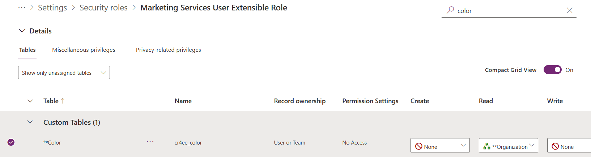
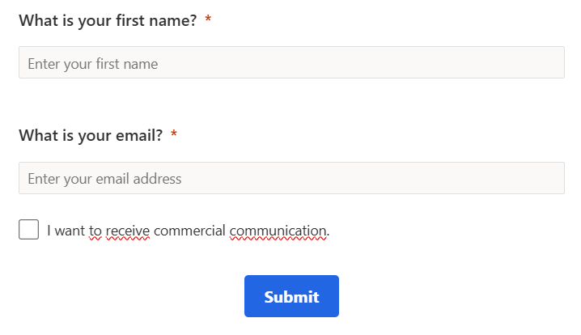
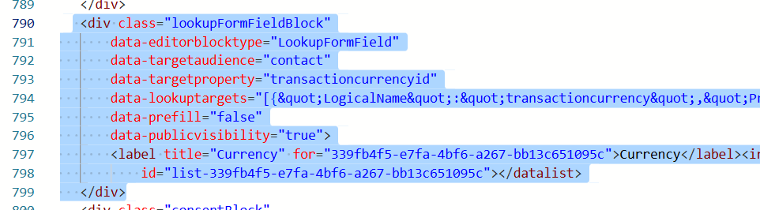
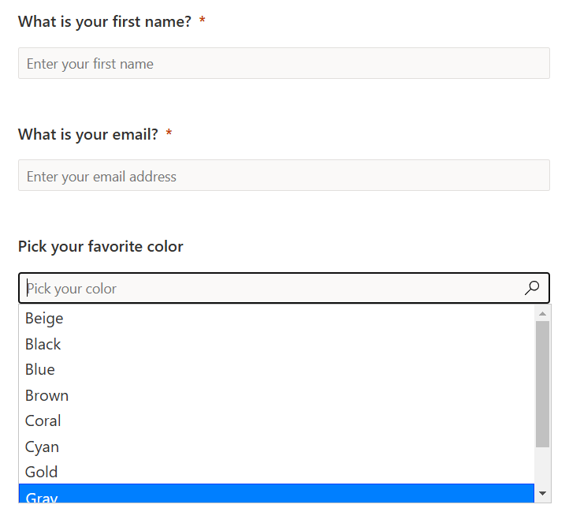
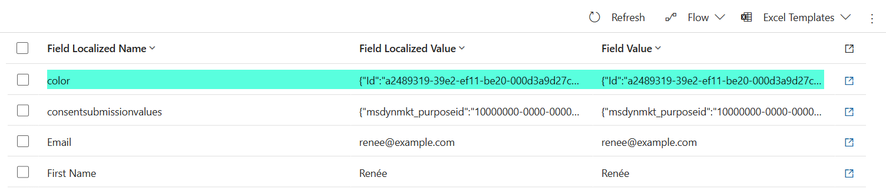

I've been using custom fields in Real-Time Journey forms quite a bit since there's no built-in way to do it yet! However, I always played it safe by using radio buttons, text fields, and checkboxes. I never attempted to add a **custom lookup field**—until now.

Recently, I encountered a scenario where I was tempted to build one myself. I wanted a lookup field pointing to a custom entity called 'Colors' without having a 'Color' field on the contact record. This means the lookup is **not** available on the contact. Below are my results!

#### Update Marketing Services User Extensible Role

Since I want (potential) customers to 'search' through our lookup entity (Colors), I need to grant the Marketing Services User Extensible Role read rights on this entity.



#### Building the Form

First, I start with a simple form containing:
1. First name
2. Email address
3. Checkbox for opt-in
4. Submit button



Next, I add an out-of-the-box lookup field from the contact—*Currency*. I set the field **Make lookup data publicly available** to "Yes" and select a filter and attribute name. Then, I open the HTML editor to inspect the generated HTML code.



Let's break down the elements found in the HTML:

| HTML Element | Meaning |
| :----------------------------------- | :-------------------------------------- |
| `data-editorblocktype="LookupFormField"` | Indicates this block contains a lookup field, used for styling |
| `data-targetaudience="contact"` | The target audience is Contact |
| `data-targetproperty="transactioncurrencyid"` | The logical name of the mapped field on the Contact |
| `data-lookuptargets="..."` | Contains the logical name of the Currency entity, the ID of the selected view, and the logical name of the selected attribute |
| `data-prefill="false"` | No prefilling of this field |
| `data-publicvisibility="true"` | The lookup data is publicly available |
| `label` | Holds the label of the input field |
| `input` | The actual input field |
| `datalist` | Holds the list of items selected in the `data-lookuptargets` view |

Here’s the full code:

```go
<div class="lookupFormFieldBlock"
    data-editorblocktype="LookupFormField"
    data-targetaudience="contact"
    data-targetproperty="transactioncurrencyid"
    data-lookuptargets="[{&quot;LogicalName&quot;:&quot;transactioncurrency&quot;,&quot;PrimarySavedQueryId&quot;:&quot;c8f16d88-e49c-48dd-af54-a6bd5102c439&quot;,&quot;PrimaryNameAttribute&quot;:&quot;currencysymbol&quot;}]"
    data-prefill="false"
    data-publicvisibility="true">
      <label title="Currency" for="339fb4f5-e7fa-4bf6-a267-bb13c651095c">Currency</label>
      <input id="339fb4f5-e7fa-4bf6-a267-bb13c651095c" type="text" name="transactioncurrencyid" placeholder="Currency" title="Currency" list="list-339fb4f5-e7fa-4bf6-a267-bb13c651095c">
      <datalist id="list-339fb4f5-e7fa-4bf6-a267-bb13c651095c"></datalist>
</div>
```

Looking closely at the `data-lookuptargets` values, I see the following:
1. **Logical Name** → The logical name of the currency entity
2. **PrimarySavedQueryId** → The ID of the view selected in the lookup field
3. **PrimaryNameAttribute** → The logical name of the attribute selected in the lookup field

Now, what if I changed these values to match my custom entity?

```go
data-lookuptargets="[{&quot;LogicalName&quot;:&quot;cr4ee_color&quot;,&quot;PrimarySavedQueryId&quot;:&quot;14286cac-6fc6-4739-8e91-d073f325e340&quot;,&quot;PrimaryNameAttribute&quot;:&quot;cr4ee_color&quot;}]"
```

Next, I update the label and input values:

```go
<label title="Color" for="339fb4f5-e7fa-4bf6-a267-bb13c651095c">Pick your favorite color</label>
<input id="339fb4f5-e7fa-4bf6-a267-bb13c651095c" type="text" name="color" placeholder="Pick your color" title="Color" list="list-339fb4f5-e7fa-4bf6-a267-bb13c651095c">
<datalist id="list-339fb4f5-e7fa-4bf6-a267-bb13c651095c"></datalist>
```

Finally, I remove the `data-targetproperty` from the `<div>` element, since this field won't be mapped to the contact. Here’s the final version of the code:

```go
<div class="lookupFormFieldBlock"
    data-editorblocktype="LookupFormField"
    data-targetaudience="contact"
    data-lookuptargets="[{&quot;LogicalName&quot;:&quot;cr4ee_color&quot;,&quot;PrimarySavedQueryId&quot;:&quot;14286cac-6fc6-4739-8e91-d073f325e340&quot;,&quot;PrimaryNameAttribute&quot;:&quot;cr4ee_color&quot;}]"
    data-prefill="false"
    data-publicvisibility="true">
      <label title="Color" for="339fb4f5-e7fa-4bf6-a267-bb13c651095c">Pick your favorite color</label>
      <input id="339fb4f5-e7fa-4bf6-a267-bb13c651095c" type="text" name="color" placeholder="Pick your color" title="Color" list="list-339fb4f5-e7fa-4bf6-a267-bb13c651095c">
      <datalist id="list-339fb4f5-e7fa-4bf6-a267-bb13c651095c"></datalist>
</div>
```

#### Results

🥁 Drum roll, please, for the lookup field on the form...



And now, for the submitted values...



It works!

#### Wrap-Up

While this feels like a workaround, with the postponed Public Preview of the Custom Fields feature, this solution might be useful in the meantime!

**Advice: Test it thoroughly.**