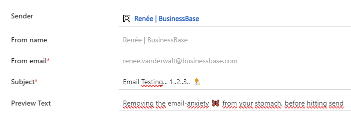
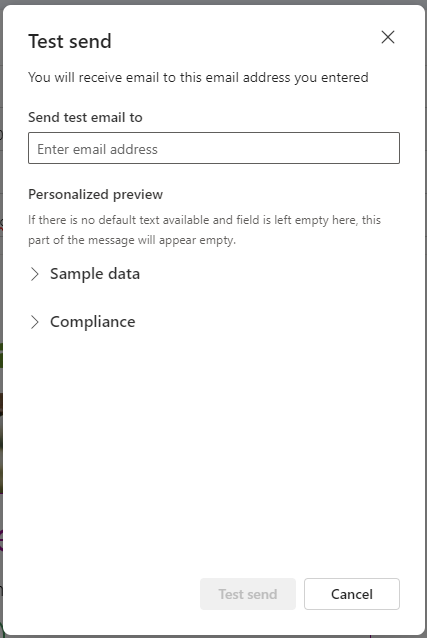
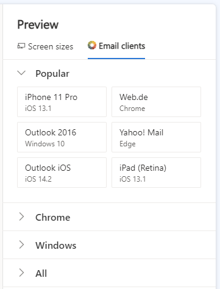
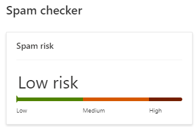
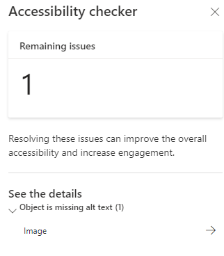
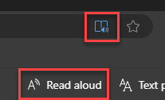
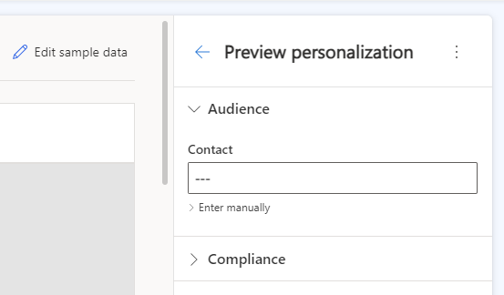

When I create an email, whether it is a monthly newsletter or an email in an automation, I always feel a little butterfly in the bottom of my stomach. This is the so-called email-anxiety butterfly 🦋. This strange little butterfly grows when I move my email from Draft mode to Live mode, and it is at its largest when I hit send.

Though I really like butterflies and have a patch in our garden to improve their well-being in the Netherlands, this email-anxiety butterfly is not my closest friend. So how can I prevent the butterfly 🦋 from becoming a big, anxious feeling 😰? It is called, email testing!

### This is why we test

There are a lot of reasons to test and thus to put effort (and money) into this process. Here are four simple but really important reasons for email testing:

1. Boosts email deliverability
2. Reduces the risk of emails landing in the SPAM folder
3. Improves email engagement
4. Eases concerns when hitting send, relieving the email-anxiety butterfly 🦋

### Testing... 1...2...3...

Now we know why we should test, lets look at some things we definitely need to test.

#### Email Envelope
The Email Envelope is all the information we see first when the email hits our inbox. Here are the things we should check before sending out the email:

1. From Name
2. From Email Address
3. Authenticated Domain
4. Subject Line
5. Preview Text

In **Dynamics Customer Insights - Journeys** we can check this in the following section:

To perform an additional check on the quality of your email envelop, see which tab your email ends up in within Gmail. You can use this tool from <a href="https://www.litmus.com/gmail-category-tab-test" target="_blank">Litmus</a> for that.

#### Email Content
After opening the email, we see all the content in it. As email marketers, we can make a ton of mistakes here. So take a good look at:

1. Typos (annoying)
2. Broken Links
3. Email Rendering Across Clients
4. Light vs. Dark Mode Rendering

The *typos* and *broken links* can be checked with a Test Send in **Dynamics Customer Insights - Journeys**.

In **Dynamics Customer Insights - Journeys**, we can check the *rendering* with the default <a href="https://learn.microsoft.com/en-us/dynamics365/customer-insights/journeys/email-preview" target="_blank">Litmus integration</a>.

Another great feature of **Dynamics Customer Insights - Journeys** is the SPAM checker functionality, as shown in the image below. If you want more details, you can also use a tool like <a href="https://analyze.email/" target="_blank"> Email Analyzer</a>.

#### Accessibility
Sending out accessible emails is good for the engagement of **all** audiences; you are more inclusive. So check your accessibility with:

1. Listening to your email over a screen reader
2. All images have ALT texts

In **Dynamics Customer Insights - Journeys**, we have a standard accessibility checker, which checks mostly for content and colours. This is also a good way to check if all images have ALT texts.

If you send out a Live Test Send (more on this later), you can open the web version of your email in Microsoft Edge. If you open the web version in Immersive Reader (F9) mode, you can make the browser read your email aloud.

#### Segmentation & Personalization

1. Check your audience
2. Check personalization

In **Dynamics Customer Insights - Journeys**, we can test the audience by looking at the segment. Checking your personalization is something you can do in the Preview and test section by editing the sample data or perform a <a href="https://renee.vanderwalt.eu/blog/how-to-send-live-test-email">Live Test Send</a>.

#### Test a Live Send
In my other post, you can check out different ways on <a href="https://renee.vanderwalt.eu/blog/how-to-send-live-test-email">how to send a Test Live Send email</a> to yourself or your colleague. In this way you can test all the following elements:

1. Email Envelope
2. Email Content
3. Accessibility
4. Segmentation & Personalization

### Wrap-up

Now that you have a good understanding of the possibilities of email testing in **Dynamics Customer Insights - Journeys**, you can create your own testing program. Start saying goodbye to the email-anxiety butterfly 🦋!