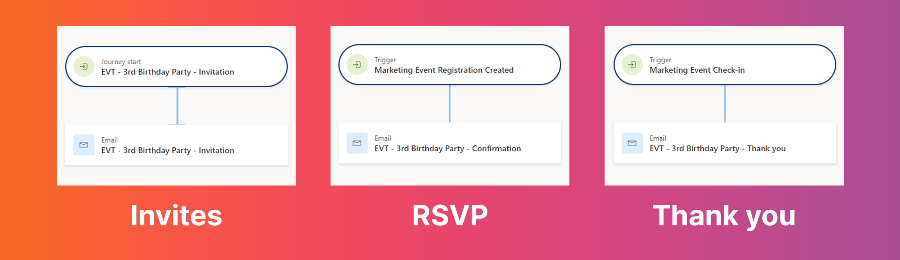

Have you ever celebrated your birthday? Like, REALLY celebrated your birthday? With a personal homemade invitation video, a list of RSVPs, uninvited guests, and definitely not enough snacks? Well, guess what my daughter's 3rd birthday party looked like this year?!

For all of you who work in Events (from planners to communication specialists and everything in between), a 3rd birthday party may seem like the simplest thing to you. But if you examine it closely, you encounter the same issues I faced when organizing big events, fundraisers, conferences, webinars, training sessions, etc.! Therefore, in the coming weeks I am going to help you! (And my daughter, because she’s been talking about ‘her’ party for weeks now). Let’s get this party started with the Basics in Event Marketing.

### Event Marketing Basics

In this blog, I am covering the basics of event marketing. I have an event, say my daughter's birthday party. There are three minimum things I want to do:

1. I want to invite people
2. I want people to RSVP
3. I want to say thank you to people who showed up

#### Invites

Why do I want to invite people? I want to make sure that the right people are aware of my daughter's birthday party, and not the weird uncle with his not-so-funny jokes. I want to make sure that they come on April 15th at 10 o’clock, instead of 4 o’clock. I want to make sure that they come to our house instead of the local playground. 
Of course I will tell them we have cake, soup and sandwiches and they are invited because it’s her 3rd birthday. All legitimate reasons why people should come!
So, here are the event marketing basics for your invitation:

1. Right audience
2. Date & location details 
3. Reasons for registering 

#### RSVP

Répondez s'il vous plaît! (Please respond) Since I have cake, soup and sandwiches, I need to make sure I have enough. So I want to know how many people will come to the birthday party. This is also called the registration process in the event marketing basics. In my case, a simple reply to my WhatsApp message will do the trick. If you’re big on organising events, you’ll probably have an Event Management tool, like the Event Module in Dynamics Customer Insights - Journeys (previously Dynamics Marketing). A simple form can help you out registering people for the right event! So I directly have a list of the right people.

And when our friends tell me that they will come, I want to thank them for telling me, so they know they are confirmed. A nice confirmation email or fun ‘after-successful-form-submit’ page can help with that as well.

The basics for RSVP’s:
1. Give people the opportunity to say ‘I’ll be there’
2. Make sure to keep a list of all registrations
3. Confirm the people who say ‘I’ll be there’

#### Saying thank you

Then finally, the day of the party arrives. People enjoyed the home-baked peanut butter and jelly cupcakes, the kids loved their Frozen cups with apple juice (yep, she’s an Elsa fan 👩🏻‍🦳❄️🤍) and the soup was a real hit. When everybody finally leaves and the kids are in bed for their afternoon nap, I want to say thanks to everyone who showed up. I want to thank them for being there and bringing such a nice gift. I also want to say I look forward to seeing them again, because I didn’t have the chance for a proper catch up chat during a toddlers birthday party.

The basics of saying thank you in event marketing:

1. Only say thanks to people who showed up
2. Refer back to what happened at your event
3. Don’t stop the conversation, invite them or direct them to a next event, blog, etc.

### Wrap-up

Three simple steps to kick off your Event Marketing Basics. Sending out invitations, receiving RSVP’s and saying thanks to the attendees. This is what it will look like in Dynamics Customer Insights - Journeys:

In the coming posts I will expand these three basics with a lot more fun!

Want to know how you can manage the Event Marketing Basics in the Event Module in Dynamics Customer Insights - Journeys (previously Dynamics Marketing)? Or do you want help setting up your own events? Just give me a message on <a href="https://www.linkedin.com/in/ren%C3%A9e-van-der-walt-89697024/" target="_blank">LinkedIn</a> (help for birthday parties are excluded 🥳)!