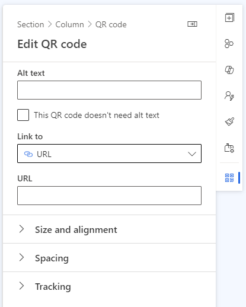
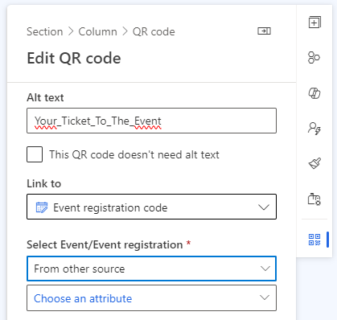
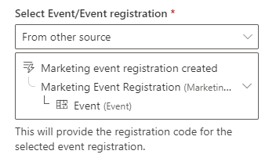
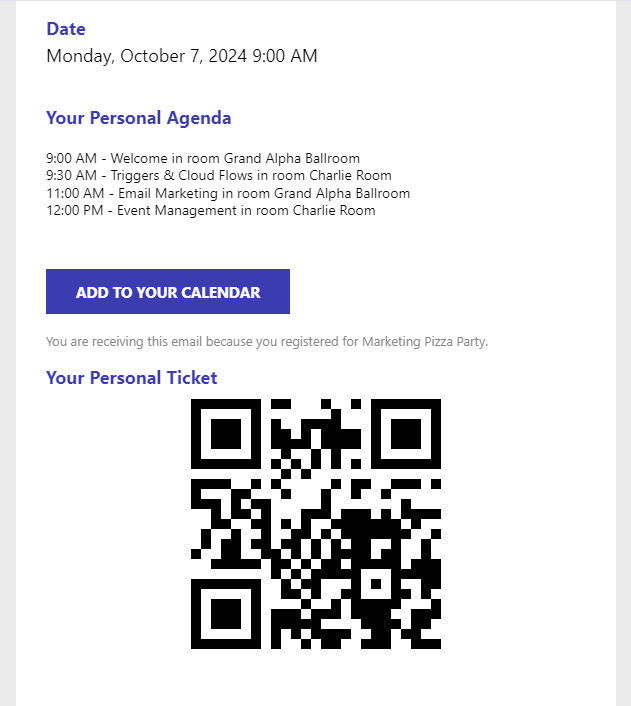

Organizing events with large numbers of participants is always challenging, especially when you want to track participation and no-show rates. The event registration QR code in Real Time Marketing Events can be helpful for checkin in registrants. In this blog post, I will show you how to set up an email with an event registration QR code that you can use for multiple events. You can also check out the <a href="#how-to-video">how-to video</a> at the bottom of this page.

This event registration QR code can serve as a personal ticket to your event. This type of personalization is good to <a href="https://renee.vanderwalt.eu/blog/seven-tips-to-prevent-no-shows">improve your no-show rate</a>.

## Step 0 - Prepare Your Email Content

Set up your confirmation and reminder messages as usual. These can be emails, text messages, or push notifications.

## Step 1 - Add the QR Code Element to Your Email

Add the QR element to your email. The menu on the right will open up.

Start by providing an ALT text. Since this is an image, always provide an ALT text. This is good for your accessibility (it can be read by screen readers) and thus also good for your SPAM score.

## Step 2 - Making the Source of the QR Code Dynamic

Set the field **Link to** to Event registration code and the **Select Event/Event registration** field to From other source.

A new field opens up which is called **Choose an attribute**. Like any other dynamic field, you can search through the different entities. In this example, we use the Event Registration Created Trigger, so we can set the Event from this Trigger.

## Result

This is what the final email looks like.

## Other ideas?

You can use the same procedure for a button containing a dynamic 'Join Teams Meeting' link!

## How to Video

<video width="100%" height="auto" controls>
<source src="../assets/images/posts/event-registration-qr-code-in-real-time-marketing-email/how-to-create-dynamic-event-registration-qr-code.mp4" type="video/mp4">
</video>