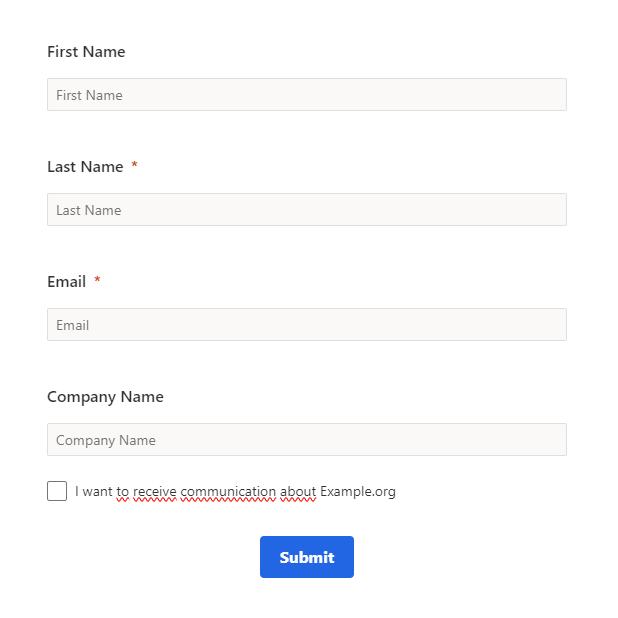
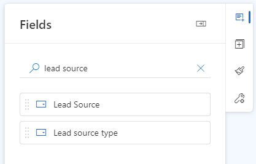
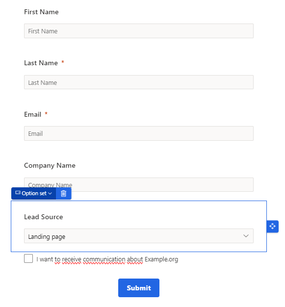
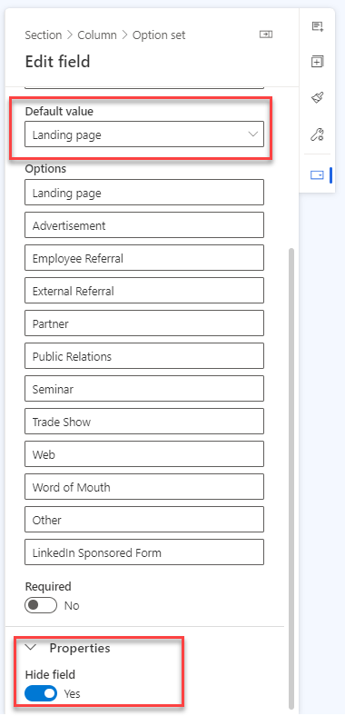

Generating leads is one of the most important jobs of using a Marketing Automation tool like Dynamics Customer Insights - Journeys (previously known as Marketing). With the transition to Real Time Marketing you can now send emails to leads directly without ever having a contact 🎉 With the Form builder in Real Time Marketing, you can create attractive Lead Generation Forms.

Unfortunately, there is one flaw...

The Lead Source is not filled automatically with Landing page, like it was in Outbound Marketing.
Are you using Lead Source in your dashboards and reporting? Here are five steps to get in done!

## Step 1

Create your lead generation Real Time Marketing Form as you like it.

## Step 2

Look for the Lead Source field in the Fields section.

## Step 3

Add the Lead Source field to your form.

## Step 4

Make the Lead Source field default value Landing page and make the field hidden.

## Step 5

Your form is ready to go. From now on, the leads generated with this form, will have a Lead Source value of Landing page.

## Source Campaign

This is something that we want for Source Campaign as well. Read <a href="https://meganvwalker.com/lookup-fields-with-default-option-available/" target="_blank">this blog of Megan V Walker</a> on how to achieve just that!