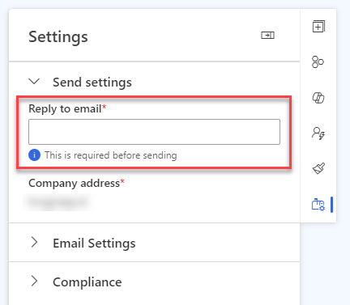
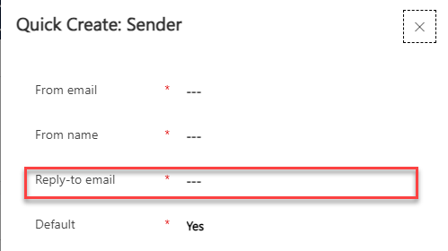

Have you ever reflected on the purpose of your reply-to email address? It holds more significance than you might think, so I will give you three reasons why. And what about no-reply email addresses? A true red flag for all things email. In this blog, I will share how you can master the 'Art of the Reply-To'.

## Reason 1 – SPAM score

Not having a proper reply-to email address is bad for your SPAM score. Especially, if you use an email address without an actual mailbox (like a no-reply address). No further explanation necessary.

## Reason 2 – The power of replies

You want replies. And, of course, people who open-up a newsletter aren’t likely to reply to you. However, if they do, you want to make sure that you do receive the message and do something with it as well. Let the customer see, that you care about what they reply to you! That is good customer experience.
And as for email stats, reply to an email is one of the best ways to let Email Clients see that you are not SPAM. So, it is good for your domain reputation as well. Two birds, with one stone!

## Reason 3 – Hidden gems in out-of-office replies

If you are, like me, working in a B2B organization, you’ll get a decent number of out of office messages when you sent out a newsletter or invitation for your event. In these out of office messages are, of course, the ‘I’m on holiday’ messages, but also the ‘I’ve changed my job’ variant. Especially these last messages contain a lot of data. You know who changed jobs, so you can update this in your CRM (clean marketing list). But sometimes you even get the details of the person who is replacing him/her or see where this contact is currently employed. This is valuable data, which you can use in your CRM.
So, if you don’t have a good reply-to email address and process, you could miss out on this valuable data!

## What makes a good reply-to email address?

One with a mailbox that is being read.

One with an automatic message? > OR NOT! Especially if you are receiving a lot of out of office messages. You can get into a loop!

## What about no-reply/noreply?

I can only say this: ‘NEVER’!

It is bad for your domain reputation, it is bad for your SPAM score, and it is bad for your customer experience. What else should I say?

By the way! If you are working in/for an organization that automatically sends out messages from Power Automate (or any other system), make sure they don’t use "no-reply" or "noreply" @yourdomain.com as well. If they are using the same sending domain as you are in your marketing emails, their sending from a no-reply email address will lower your domain reputation as well! Just keep that in mind!

By the way #2! That is why I would always suggest using a sub domain for sending marketing emails and to warm up this domain. Need help with that, let me know!

## How to set a reply-to address

If you want to make sure that replies land in the right inbox, set the reply-to email address. In Dynamics Customer Insights - Journeys you can do this in two places. In the email itself or by creating a Sender in your Brand Profile.

 
## Become an artist too

Here are the three main takeaways of becoming an artist of the reply-to:
1.	Set a good reply email address with an actual inbox
2.	Make sure there is a process to follow up (automatic) replies
3.	NEVER use no-reply or noreply email addresses as Sender or Reply-to
