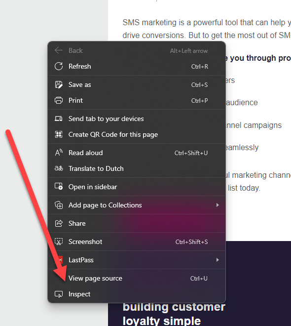
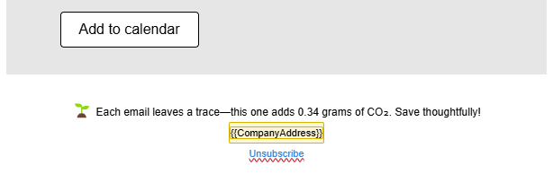

In November, I had the pleasure of exploring the Event Marketing Trends in 2025 with the <a href="https://www.linkedin.com/company/customer-experience-user-group/posts/?feedView=all" target="_blank">CXP User Group</a>. One of the key trends is adopting more sustainable practices for your events. Many of these concepts also apply to email marketing. Let’s look at a few strategies to measure and enhance the sustainability of your email campaigns.

### Calculate the Footprint of Your Email

The <a href="https://parcel.io/tools/carbon-footprint" target="_blank">Parcel tool</a> is an excellent resource for calculating the CO₂ footprint of your email campaigns. You’ll need two things:

1. The number of subscribers.
2. The **actual** HTML of your email.

I emphasize **actual** because there is a difference between the HTML from the Dynamics Customer Insights - Journeys email editor and the **actual** HTML that is sent in the email. Surprising, isn’t it? 👻

To get the correct HTML, send a <a href="https://renee.vanderwalt.eu/blog/how-to-send-live-test-email">live test email</a> to yourself, including the web version link. Open the web version link, right-click, and select "View page source."

This will provide the file containing the **actual** HTML of your email. Copy and paste this HTML into the Parcel tool to calculate your email's carbon footprint.

#### How Can This Be Used?

Great question! There are several ways to use this information. First, you can measure the environmental impact of your campaigns and include it in environmental reports. Additionally, you can raise awareness among your audience about their email footprint, as shown in the example below.

### Keep a Clean List

Since every email you send impacts the environment, maintaining a clean list can help reduce that impact in several ways:

1. Reducing energy consumption in data centers.
2. Minimizing the carbon footprint of email communications.
3. Preventing data pollution.

Stay tuned for an upcoming blog post where I’ll dive deeper into strategies for keeping a clean list.

### From Physical to Digital

The era of physical leaflets and brochures is quickly fading. A powerful digital alternative is the use of QR codes. These provide a seamless way for individuals to access digital flyers, brochures, or event programs directly on their devices, eliminating the need for printed materials. When paired with a well-designed form at the QR code’s URL, it can also serve as a tool for capturing valuable audience data.

### Use Text Messages or WhatsApp in Your Journeys

Numerous studies highlight the carbon impact of everyday products and services. Did you know the carbon footprint of a text message is significantly lower than that of an email? Even WhatsApp messages have a smaller footprint compared to emails. Incorporating text messages into your communication process not only benefits the environment but also increases engagement, as text messages boast high open and click-through rates.

### Wrap-Up

There are several steps you can take to make your marketing more sustainable, even within Dynamics Customer Insights. Let’s kick off the new year with a greener, more sustainable marketing program!
