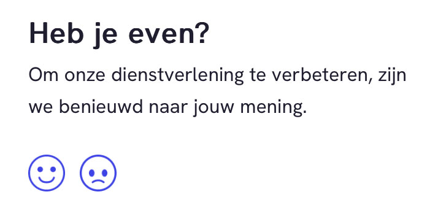
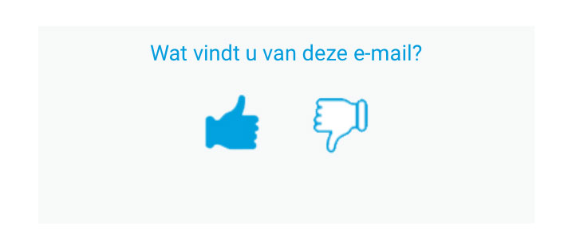
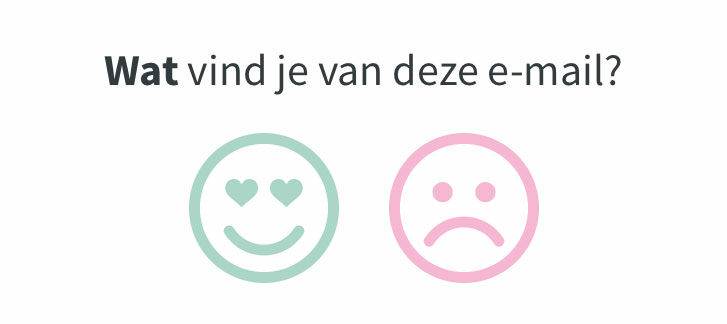
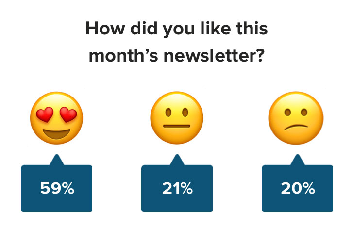
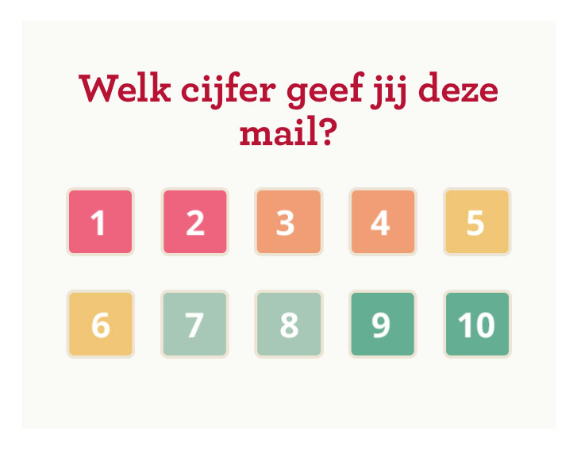

I've been in email marketing quite some years now. And every time I hit the send (or plan) button, there is that moment of doubt and fear. Do we have everything right?

All the technical stuff like alt text on images, checking links, and UTM coding is covered (see why, next time). No, I'm worried about the message and whether or not the target segment likes it. Of course, we have KPIs like Open Rate (OR), Click Through Rate (CTR), Click To Open Rate (CTO) and conversion, but did they like the email? And if they did, why? Let's get some feedback from our email!

## How to ask for feedback?

There are multiple ways you can ask for feedback. Let's take a look at some (Dutch) examples.

*Example 1 - Do you have a minute? To improve our services, we are curious about your opinion.*

*Example 2 - What do you think of this email?*

*Example 3 - What do you think of this email?*

*Example 4 - What do you think of this email?*

*Example 5*

*Example 6 - What do you think of this email?*

*Example 7 - Tell us what you think*

*Example 8 - What did you think of this email?*

*Example 9 - How do you rate this email?*

## What can we learn from these examples?

9/9 use a combination of emojis (emotions), color, or numbers to display someone's feelings towards the email.

7/9 use present tense, which seems strange. This feedback request is mainly positioned at the end of the email. So you will give feedback after reading the email. Chronologically, it should be in past tense.

6/9 place the icons/emojis in reversed order, from like to dislike. This might seem strange since in surveys we use the dislike to like order. But because most of the examples use this order, it might be your way to go.

6/9 use two or three options to choose from.

Example 2 uses a filled and outlined icon. This might create a bias towards the filled one. That is why we use filled buttons to be primary buttons and outlined buttons to be secondary buttons.

Example 4 uses text next to the icon. This might be due to the target audience not understanding the emotions belonging to the thumbs. But this is just a guess.

Example 5 uses the <a href="https://www.litmus.com/blog/new-in-litmus-live-polls" target="_blank">Live Polls</a> functionality of Litmus to show the percentage of people clicking on that link. However, it might create a bias towards the option mostly clicked. People tend to conform with others (social proof) so they might not give their straight opinion but follow the opinion of the many.

Example 9 uses ten options(!). That might be a bit too much in my opinion, especially on mobile phones when the ten options get divided into two rows.

### Conclusion

There are four main lessons we can learn from these examples:

1. Use a **combination** of emojis, numbers, colors or your own icons. A great way to see what works best is a nice A/B test.
2. Use two or three **options** to display someone's feelings towards the emails.
3. Use the past **tense** in your accompanying text.
4. Use the reversed **order** in your emotions (from happy to unhappy), but try some A/B tests to see whether this actually works.

## After the click in the email

Once you give your feedback on the email by clicking one of the emojis, icons, or numbers, you are directed to a new page. From the nine examples above, these are the results.

1. 4/9 have a different (or dynamic) page where you can see your feedback and have the option to give more feedback in a **text area field**.
2. 3/9 have one page in which you can see your result as **an answer to a question** and have the option to give more feedback in a text area field.
3. 1/9 has a different (or dynamic) page where you can see your feedback and have the option to give more feedback in an **option set**.
4. 1/9 has only a **confirmation page**, where you can see your feedback. No option to give more feedback.

See how your audience responds to one of these options or do some A/B testing to see which options scores best!

## How to get feedback on Customer Insights - Journeys emails?

There are different routes you can take:
1. Use a Customer Voice survey for each option and give them an extra field to provide feedback (like option #1 and #4).
    - If you want to collect feedback per email, create a variable 'Marketing Email' in Customer Voice and use the share via URL method to create a specific URL for this newsletter.
    - If you want to see who is your respondent in Customer Voice, message me on <a href="https://www.linkedin.com/in/ren%C3%A9e-van-der-walt-89697024/" target="_blank">LinkedIn</a> and I will tell you how to fix this.
2. Use a confirmation page for each option that is tracked in GA4 with a key event and check in GA4 how many people have landed on this page. This way, when you have your UTM set up properly, you can even see which email got which feedback.
3. Use external tools like <a href="https://www.getfeedback.com/" target="_blank">GetFeedback</a> or <a href="https://www.closealert.com/" target="_blank">CloseAlert</a> to get your feedback.

## Wrap up

Collecting feedback from your email marketing is always a good idea. KPIs like CTR, CTO and conversion always tell you the results. But how nice would it be to get actual feedback on your email marketing and even some written words to get more context and reasoning? And when you get the feedback, try doing something with it, otherwise why did you ask in the first place?