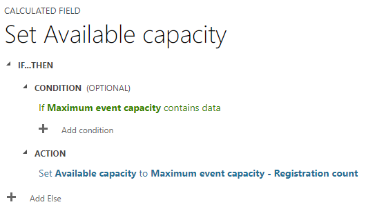

Once you're comfortable with the <a href="https://renee.vanderwalt.eu/blog/event-marketing-basics">basics of event marketing</a> and your <a href="https://renee.vanderwalt.eu/blog/please-register-here">invitation process</a>, you might consider stepping up your game. So, why not introduce some urgency into the event registration process?

For my daughter’s Elsa-themed 👩🏻‍🦳❄️🤍 3rd birthday party, where there's no commercial benefit, the need to create urgency isn't particularly high. However, when organizing events with commercial goals such as generating leads, creating opportunities, and following up on them, incorporating urgency becomes crucial. Therefore, building urgency appears to be the logical next step in your event communications. Discover why it's beneficial and how easily it can be done right in Dynamics Customer Insights – Journeys.

## Why create urgency?

Why do we aim to instill urgency in our event communications, or any other communications for that matter? There are several benefits to consider:

- Fear of Missing Out (FOMO): People fear missing out, so when they sense that time is running out, they're more inclined to act promptly.
- Higher Click-Through Rate (CTR): Urgency prompts people to click sooner on your emails because they don't want to miss out on opportunities.
- Higher Conversion Rate: Urgency encourages quicker conversions as people want to ensure they're not left behind.

Urgency can serve both conversion and teasing purposes. By teasing potential customers with urgency, their attention and engagement towards the event, speakers, promotions, or giveaways increase.

## How to create urgency? - Using a countdown timer

There are several tools available, free of charge, to integrate countdown timers into your emails. We've tested a few and found the following to work well:

-	Sendtric
-	NiftyImages
-	EmailTimers
-	CountdownMail

While free options exist, opting for a paid account provides additional branding options and longer countdown dates.

### How to use countdown timers in Dynamics Customer Insights - Journeys?

These tools generate code that needs to be inserted into your emails. Follow these steps:

1.	Copy the code generated by the tool.
2.	Open the email where you want to include the countdown timer.
3.	Insert a one-column section.
4.	Insert a custom code element.
5.	Paste the code into your custom code element and preview it to ensure it displays correctly.

As always, test your email using the Litmus integration to ensure compatibility across different email clients.

## How to create urgency? - Using the number of available spots

For events, you can also create urgency by limiting the number of available spots. This might ‘nudge’ the (potential) customers faster in your event journey. Choose the timing of displaying this information wisely. Once all spots are filled, registration should no longer be possible.

You can incorporate the number of available spots in both your email and registration form. However, note that while the number remains static in emails, it's dynamic on the registration form.

### How to set up the number of available spots?

Create a new column on the event table as a calculated field. Use the following calculation:

You can choose to display this column on the event form in Dynamics or solely on your registration form, as demonstrated in the following video.

<video width="100%" controls>
<source src="../assets/images/posts/building-urgency/How-to-add-field-to-registration-form.mp4" type="video/mp4">
</video>

By the way, you can utilize this method to include other event details on your registration form as well.

## Wrap up

Utilizing urgency in event communications offers numerous benefits. It not only aids in conversion but also enhances teasing efforts. Moreover, these benefits extend beyond event communications to all forms of communication.

By incorporating countdown timers in your emails or displaying the number of available spots on your event registration form, you can effectively nudge (potential) customers to register for your event. Success guaranteed!