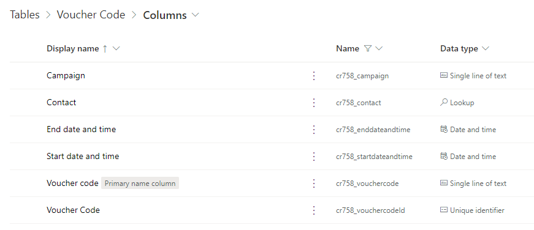
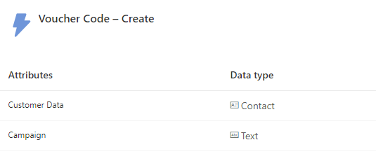
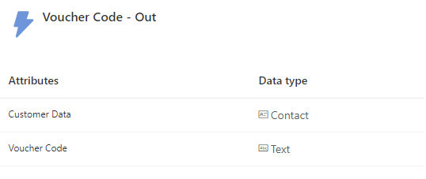
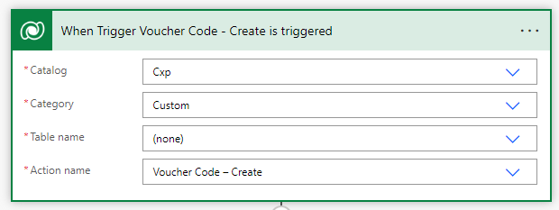
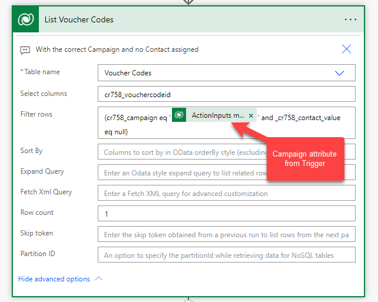
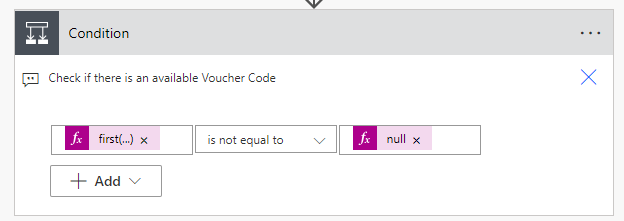
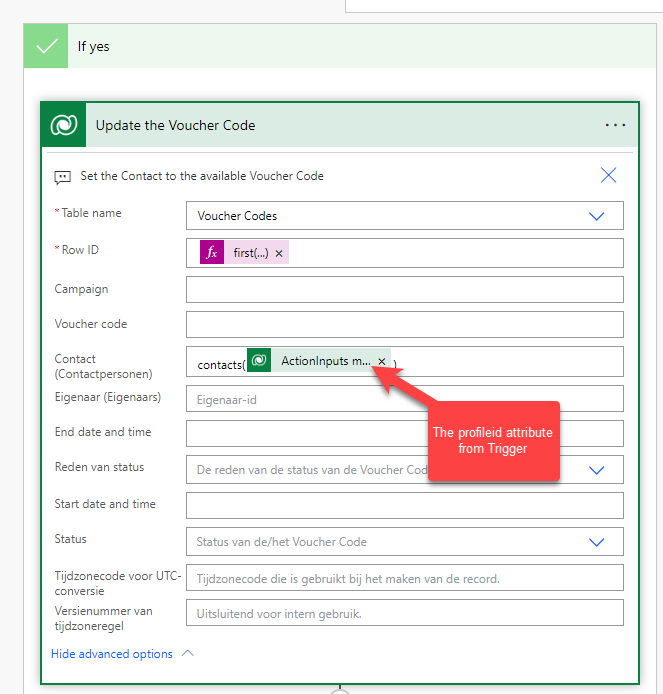
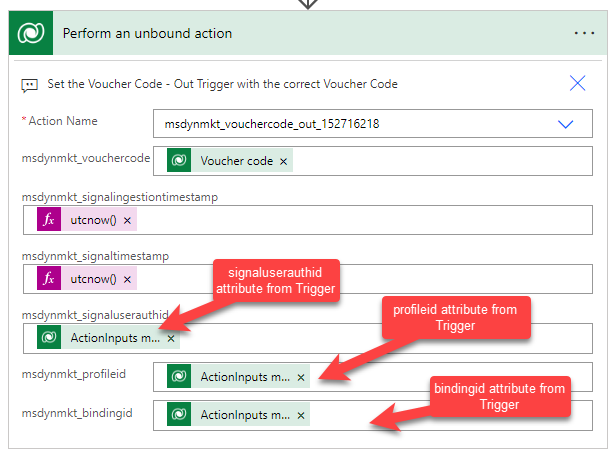

## Business Challenge

We want to give our customer a unique **voucher code** so that they get discounts in the online or physical shop. We want to use it to provide access to various campaigns in external applications, such as early bird access, product launches, or specific promotions. These voucher codes can have a certain validity period, so we want to be able to set a start- and end date of the specific voucher code. The voucher codes are part of a certain campaign, because we run several voucher codes at the same time. This means, that a customer could have more than one active voucher code. We want to use these voucher codes in email marketing, so that we can sent out an email that they received a voucher code, or that their voucher code is ending.

Since these voucher codes are used in external applications, the generation of the voucher codes is done via an import and the user needs to make sure that there are enough voucher codes.

## The Solution in Short
1.	Create a voucher code table with a relationship to contacts.
2.	Create two Real Time Marketing triggers that can be used in a journey.
3.	Create a Power Automate after this trigger that connects the contact to an available voucher code.
4.	Create a Real Time Marketing email to get the voucher code to the customer.
5.	Create a Real Time Marketing journey to combine all things together.

This post will focus on the set-up, so steps one till three. The <a href="https://renee.vanderwalt.eu/blog/using-voucher-codes-in-dynamics-customer-insights-part-2">next post</a> will focus on steps four and five.

## Create the Table

First we need to create a table where we can store our voucher codes. So create the table with the following fields:
1.	Voucher Code > textfield (required)
2.	Campaign > textfield (required)
3.	Start date and time > time and date field
4.	End date and time > time and date field
5.	Contact > lookup to contact

So your table looks like this:


  
Make sure you give users access to create voucher codes and add the table to the Marketing App, so users can create the voucher codes from within the App.

## Create the Real Time Marketing Triggers

We need to create two Real Time Marketing triggers. One trigger that starts the Power Automate in which we need to set the campaign. One trigger which is filled with the voucher code so we can use it in our Emails.

### Trigger: Voucher Code – Create

Create a custom trigger called Voucher Code – Create, and starts “When a customer interacts with a website/app”. Add an additional attribute called “Campaign” and set it as Text.


 
### Trigger: Voucher Code – Out

Create a custom trigger called Voucher Code – Out, and starts “When a customer interacts with a website/app”. Add an additional attribute called “Voucher Code” and set it as Text.


 
## Create the Power Automate

In this Power Automate we are going to combine the two triggers. So the starting trigger makes sure we know which voucher code to list based on the campaign. We then set the contact to an available voucher code. And then we add the voucher code to the ending trigger, so we know that the voucher code was connected to the contact.

### Step 1 – Start Power Automate on Trigger

Start the Power Automate based on an action.
 


### Step 2 – List rows

List the rows of the voucher code table with the corresponding campaign and no contact connected yet.


 
### Step 3 – Condition

To make sure that there actually is a voucher code available, we check whether or not we receive a voucher code from the previous step.


 
The expression that I use in this step equals:
```go
first(body('List_Voucher_Codes')?['value'])
```

### Step 4 – Update a Row

In the yes lane, the next step is to update the voucher code that we got with the correct contact.


  
The expression that I use in the Row ID field is:
```go
first(body('List_Voucher_Codes')?['Value'])?['cr758_vouchercodeid']
```

### Step 5 – Perform an unbound action

The final step is to add the voucher code to the Voucher Code – Out trigger.


 
### Step 6 – No branch

If you want to make sure that you receive a message when you run out of voucher codes, you can create a task 
for yourself in the no branch of the condition or any other form of communication that you prefer.

## Possible variations
Of course you can think of a couple of variations on this process. You can use leads instead of contacts or use them both. Make sure you add additional checks and changes for the lead entity.

There could be a scenario where Dynamics creates the voucher codes or where extra fields are necessary on the voucher code entity. This is just a simple version of the voucher codes; use your imagination to create additional use cases.